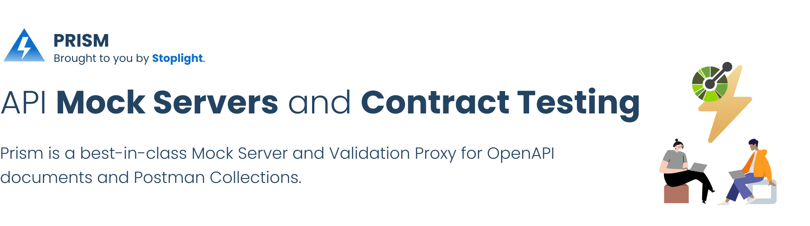

[][mocking_landing_page]

[![CircleCI][circle_ci_image]][circle_ci]
[![NPM Downloads][npm_image]][npm]
[][stoplight_forest]

# Prism Overview

Prism is a set of packages for API mocking and contract testing with **OpenAPI v2** (formerly known as Swagger) and **OpenAPI v3.x**.

Prism provides:

- **Mock Servers**: Life-like mock servers from any API specification document.
- **Validation Proxy**: Contract Testing for API consumers and developers.
- **Comprehensive API Specification Support**: OpenAPI v3.1, OpenAPI v3.0, OpenAPI v2.0 (formerly Swagger) and Postman Collections.

## Ways to Use Prism

### Hosted Prism

Stoplight provides hosted mock servers for convenience so that API consumers can experiment with an API without the need for backend code.

Use one of these options for instant, hosted mock servers:

- [Stoplight Platform](https://stoplight.io/?utm_source=github.com&utm_medium=referral&utm_campaign=github_repo_prism): Collaborative API Design Platform for designing, developing and documenting APIs with hosted mocking powered by Prism.
- [Stoplight Studio](https://stoplight.io/studio/?utm_source=github.com&utm_medium=referral&utm_campaign=github_repo_prism): Free visual OpenAPI designer that comes integrated with mocking powered by Prism.

Learn more in the [hosted Prism documentation](https://docs.stoplight.io/docs/platform/336b74db38c50-work-with-mock-servers).

### Self-hosted Prism

Prism is an open-source HTTP server run from the command-line. It provides mocking, request validation, and content negotiation. Use it standalone tool or in continuous integration.


## Installation and Usage

This information refers to Open Source Prism 3.x, which is the current version most likely you will use. If you're looking for the 2.x version, look at the [`2.x` branch][2.x]

### Install Self-hosted Prism

Prism requires

- NodeJS >= 18.20.1
- for NodeJS 18.x, [>= 18.16 is required](https://github.com/stoplightio/prism/issues/2305)

```bash
npm install -g @stoplight/prism-cli

# OR

yarn global add @stoplight/prism-cli
```

For more installation options, see our [installation documentation](./docs/getting-started/01-installation.md).

### Mocking

Prism can help you create a fake "mock" based off an OpenAPI document, which helps people see how your API will work before you even have it built. Run it locally with the `prism mock` command to run your API on a HTTP server you can interact with.

```bash
prism mock https://raw.githack.com/OAI/OpenAPI-Specification/master/examples/v3.0/petstore-expanded.yaml
```

Learn more about [how the mock server works](docs/guides/01-mocking.md).

### Validation Proxy

Prism can help you check for discrepencies between your API implementation and the OpenAPI document that describes, letting you funnel HTTP traffic through it with the `prism proxy` command.

```bash
prism proxy examples/petstore.oas2.yaml https://petstore.swagger.io/v2
```

Learn more about [how the validation proxy works](docs/guides/03-validation-proxy.md).

## 📖 Documentation and Community

- [Documentation](https://docs.stoplight.io/docs/prism/674b27b261c3c-prism-overview)
  - [Getting Started](./docs/getting-started/01-installation.md)
  - [Guides](./docs/guides/01-mocking.md)
- [Community](https://github.com/stoplightio/prism/discussions)

### ❓ FAQs

**Cannot access mock server when using Docker?**

Prism uses localhost by default, which usually means 127.0.0.1. When using docker the mock server will
be unreachable outside of the container unless you run the mock command with `-h 0.0.0.0`.

**Why am I getting 404 errors when I include my basePath?**

OpenAPI v2.0 had a concept called "basePath", which was essentially part of the HTTP path the stuff
after host name and protocol, and before query string. Unlike the paths in your `paths` object, this
basePath was applied to every single URL, so Prism v2.x used to do the same. In OpenAPI v3.0 they
merged the basePath concept in with the server.url, and Prism v3 has done the same.

We treat OAS2 `host + basePath` the same as OAS3 `server.url`, so we do not require them to go in
the URL. If you have a base path of `api/v1` and your path is defined as `hello`, then a request to
`http://localhost:4010/hello` would work, but `http://localhost:4010/api/v1/hello` will fail. This
confuses some, but the other way was confusing to others. Check the default output of Prism CLI to
see what URLs you have available.

### 🚧 Roadmap

- [x] Content Negotiation
- [x] Security Validation
- [x] Validation Proxy
- [ ] [Recording/Learning Mode](https://roadmap.stoplight.io/c/324-learning-recording?utm_source=github&utm_medium=prism&utm_campaign=readme) (create OpenAPI from HTTP traffic)
- [ ] [Data Persistence](https://roadmap.stoplight.io/c/308-persisted-mock-data?utm_source=github&utm_medium=prism&utm_campaign=readme) (allow Prism act like a sandbox)

Submit your ideas for new functionality on the [Stoplight Roadmap](https://roadmap.stoplight.io/?utm_source=github&utm_medium=prism&utm_campaign=readme).

### 🏁 Help Others Utilize Prism

If you're using Prism for an interesting use case, [contact us](mailto:growth@stoplight.io) for a case study. We'll add it to a list here. Spread the goodness 🎉

### 👏 Contributing

If you are interested in contributing to Prism itself, check out our [contributing docs ⇗][contributing] and [code of conduct ⇗][code_of_conduct] to get started.

### 🎉 Thanks

Prism is built on top of lots of excellent packages, and here are a few we'd like to say a special thanks to.

- [ajv](https://www.npmjs.com/package/ajv)
- [faker](https://www.npmjs.com/package/@faker-js/faker)
- [fp-ts](https://www.npmjs.com/package/fp-ts)
- [gavel](https://www.npmjs.com/package/gavel)
- [json-schema-faker](https://www.npmjs.com/package/json-schema-faker)
- [lerna](https://www.npmjs.com/package/lerna)
- [micri](https://www.npmjs.com/package/micri)
- [openapi-sampler](https://www.npmjs.com/package/openapi-sampler)
- [yargs](https://www.npmjs.com/package/yargs)

Check these projects out!

### 🌲 Sponsor Prism by Planting a Tree

If you would like to thank us for creating Prism, we ask that you [**buy the world a tree**](https://ecologi.com/stoplightinc).

[code_of_conduct]: CODE_OF_CONDUCT.md
[contributing]: CONTRIBUTING.md
[download-release]: https://github.com/stoplightio/prism/releases/latest
[core]: https://www.npmjs.com/package/@stoplight/prism-core
[http]: https://www.npmjs.com/package/@stoplight/prism-http
[http-server]: https://www.npmjs.com/package/@stoplight/prism-http-server
[cli]: https://www.npmjs.com/package/@stoplight/prism-cli
[cli-docs]: ./docs/getting-started/03-cli.md
[2.x]: https://github.com/stoplightio/prism/tree/2.x
[http-docs]: packages/http/README.md
[mocking_landing_page]: https://stoplight.io/api-mocking?utm_source=github.com&utm_medium=referral&utm_campaign=github_repo_prism
[circle_ci]: https://circleci.com/gh/stoplightio/prism
[circle_ci_image]: https://img.shields.io/circleci/build/github/stoplightio/prism/master
[npm]: https://www.npmjs.com/package/@stoplight/prism-cli
[npm_image]: https://img.shields.io/npm/dw/@stoplight/prism-http?color=blue
[stoplight_forest]: https://ecologi.com/stoplightinc
