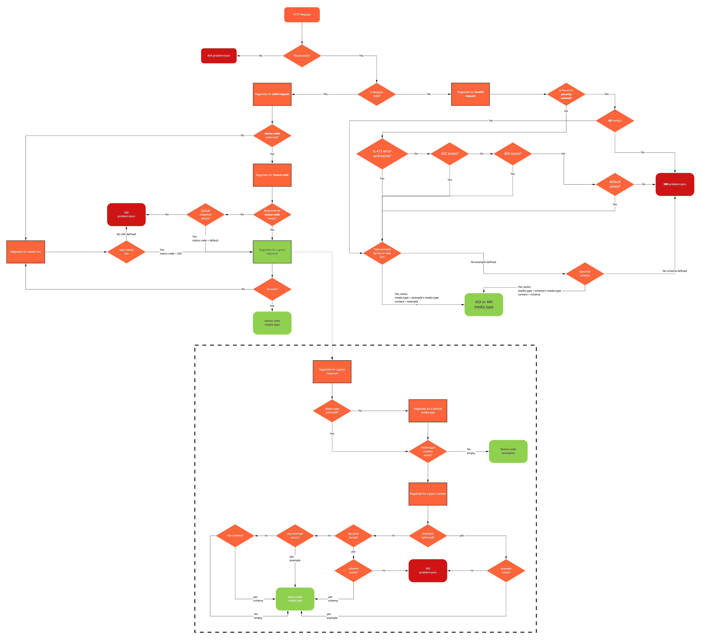

# HTTP Mocking

Prism's HTTP mock server simulates a real web API by providing endpoints and validation rules described in your API description document. This allows client developers to begin writing code for frontend services like web, mobile, or other backend applications, while API developers are still writing code. This can help find and solve problems early on, before the API is built, because changing all that code can be expensive.

- Does the API contain the information the client needs?
- Is that data in the format the client needs?
- Are the resources too "normalized" and data-centric (instead of being use-case centric) that the client has to 3292375 calls to get all the data?
- Is there enough time left for feedback to be implemented?
- If the feedback spawns large enough work, will the client have time implement this API once it's done?
- Avoid these problems by getting a free API to play with without spending a month building it all.

Catching problems early on while you're still just tweaking the API descriptions (maybe using [Studio](https://stoplight.io/studio)), means you can avoid making costly changes to the production API, deprecating old things, or creating whole new global versions which add a huge workload to every single client.

Just like HTTP messages, there are two halves to mocking: requests and responses.

- [Response Generation](#response-generation)
- [Request Validation](#request-validation)

## Response Generation

Prism will try to return meaningful responses based on whatever information it has available, like response examples, and use various fallback mechanisms in case no examples were provided. This means any OpenAPI description document can be used with no extra work, but better documents provide better results.

The first thing to understand is that the Prism HTTP Server respects [Content Negotiation](https://developer.mozilla.org/en-US/docs/Web/HTTP/Content_negotiation). If your API is a mixture of JSON, XML and form data, you can use `Accept`
and `Content-Type` just like with a real API, and it should work as expected, or fail if you request non-existent types.

### The "Decision Engine"

The response Prism decides to give can be figured out with this decision flow diagram.



### Response Examples

If a response has an example, it will be used for the response. If there are multiple examples then they can be selected by name. In the following OpenAPI description, the operation has a 200 OK response and multiple examples:

```yaml
responses:
  '200':
    description: OK
    content:
      application/json:
        schema:
          '$ref': '#/components/schemas/Pet'
        examples:
          cat:
            summary: An example of a cat
            value:
              id: 2
              name: Fluffy
              photoUrls: []
          dog:
            summary: An example of a dog
            value:
              id: 1
              name: Spot
              photoUrls:
                - https://images.dog.ceo/breeds/kelpie/n02105412_893.jpg
```

Calling `curl http://127.0.0.1:4010/pets/123` on this will give:

```json
{
  "id": 2,
  "name": "Fluffy",
  "photoUrls": []
}
```

Calling the same URL with the `Prefer` header `example=dog` `http://127.0.0.1:4010/pets/123` will yield to:

<!-- theme: info -->

> #### Remember to provide expected response code
>
> It's always worth indicating the HTTP response code from which `example` should be taken. If Prism decides to change the response code due to validation or security violations, your `example` might be ignored.

```json
{
  "id": 1,
  "name": "Spot",
  "photoUrls": ["https://images.dog.ceo/breeds/kelpie/n02105412_893.jpg"]
}
```

### Static or Dynamic Generation

By default, Prism uses a **static generation strategy**, which is outlined below. You can enable the dynamic examples generation by using the `-d` flag in the command line.

```yaml
prism mock api.oas3.yaml # Static examples

prism mock -d api.oas3.yaml # Dynamic examples
```

If the HTTP server has been started in static mode, specific calls can be made in dynamic mode by specifying the `Prefer` header with the `dynamic` key to `true`.

#### Static Response Generation

If the provided OpenAPI Schema Object has a response body example, it's used to provide a response.

If not, a response body will be created by looking through the whole `schema` object (following any `$ref`'s it finds along the way) to create a full fake response.

- If the property has a default value, then it will return the specified value.
- If the property has an `examples` value, then it will return the first element in the array.
- If the property has neither an example nor a default value and **is nullable**, it will return null.
- If the property has neither an example nor a default value and **isn't nullable**, but has a `format` specified, then it will return a meaningful static value according to the format.
- If the property has neither an example nor a default value, isn't nullable, and has no `format` specified, then it will return `'string'` in case of a string and `0` in case of a number.

For example, this is a schema component found in an OpenAPI description document:

```yaml
Pet:
  type: object
  properties:
    id:
      type: integer
      format: int64
    name:
      type: string
      example: doggie
    photoUrls:
      type: array
      items:
        type: string
```

When you call `curl http://127.0.0.1:4010/pets/123`, the operation references this component and a doggie is returned:

```json
{
  "id": 0,
  "name": "doggie",
  "photoUrls": ["string"]
}
```

Notice that `name` had an `example` with a value so Prism used it, but `photoUrls` didn't, so it just returned `"string"`. 🤷‍♂️

#### Dynamic Response Generation

Testing against the exact same piece of data over and over again isn't the best way to build a robust integration. What happens when a name is longer than you expected, or the value happens to be 0 instead of 6?

Dynamic mode solves this by generating a random value for all the properties according to their type, and other information like `format` or even the all-powerful `x-faker` extension.

All the random properties are generated using [Faker.js](https://github.com/faker-js/faker) under the hood, via [JSON Schema Faker](https://github.com/json-schema-faker/json-schema-faker). The `x-faker` keyword is optional, but when present allows for a specific Faker API method to be used (of which there [are a lot](https://github.com/faker-js/faker#api)) so you get a lot of control over the response.

```yaml
Pet:
  type: object
  properties:
    id:
      type: integer
      format: int64
    name:
      type: string
      x-faker: name.firstName
      example: doggie
    photoUrls:
      type: array
      items:
        type: string
        x-faker: image.imageUrl
```

Call `curl http://127.0.0.1:4010/pets/123 -H "Prefer: dynamic=true"`, the operation references this component and a doggie is returned:

```json
{
  "id": 12608726,
  "name": "Addison",
  "photoUrls": [
    "http://lorempixel.com/640/480",
    "http://lorempixel.com/640/480",
    "http://lorempixel.com/640/480",
    "http://lorempixel.com/640/480"
  ]
}
```

The more descriptive your description is, the better job Prism can do at creating a mock response.

<!-- theme: info -->

> **Tip:** If your team needs help creating better quality API description documents, take a look at [Spectral](https://stoplight.io/spectral/). You could enforce the use of `example` properties, or similar.

##### Control Generated Fakes for Individual Properties

In the following example there are two properties, each with specific Faker parameters.  [datatype.number](https://fakerjs.dev/api/datatype.html#number) uses named parameters while [helpers.slugify](https://fakerjs.dev/api/helpers.html#slugify) uses positional parameters. 

```yaml
example:
  type: object
  properties:
    ten-or-eleven:
      type: number
      example: 10
      x-faker:
        datatype.number:
          min: 10
          max: 11
    slug:
      type: string
      example: two-words
      x-faker:
        helpers.slugify: [ "two words" ]
```

##### Configure JSON Schema Faker

At the top level of your API Specification, create an `x-json-schema-faker`
member containing a map of [JSON Schema Faker Options](https://github.com/json-schema-faker/json-schema-faker/tree/master/docs#available-options) and their values. An
additional `locale` option is accepted to configure the `locale` of the
underlying Faker instance.

```yaml
openapi: 3.1.0

x-json-schema-faker:
  locale: de
  min-items: 2
  max-items: 10
  resolve-json-path: true
```

## Request Validation

Having a mock server that only gives responses would not be useful, which is why
Prism imitates request validation too. An OpenAPI description document is
full of validation rules like type, format, max length, etc. Prism can
validate incoming messages and provide validation feedback if it receives invalid
requests.

Read more about this in the [Prism Request Validation guide](./02-request-validation.md).

## Deprecating operations

If an operation is marked as `deprecated: true` then Prism adds `Deprecation: true` header to the response.
