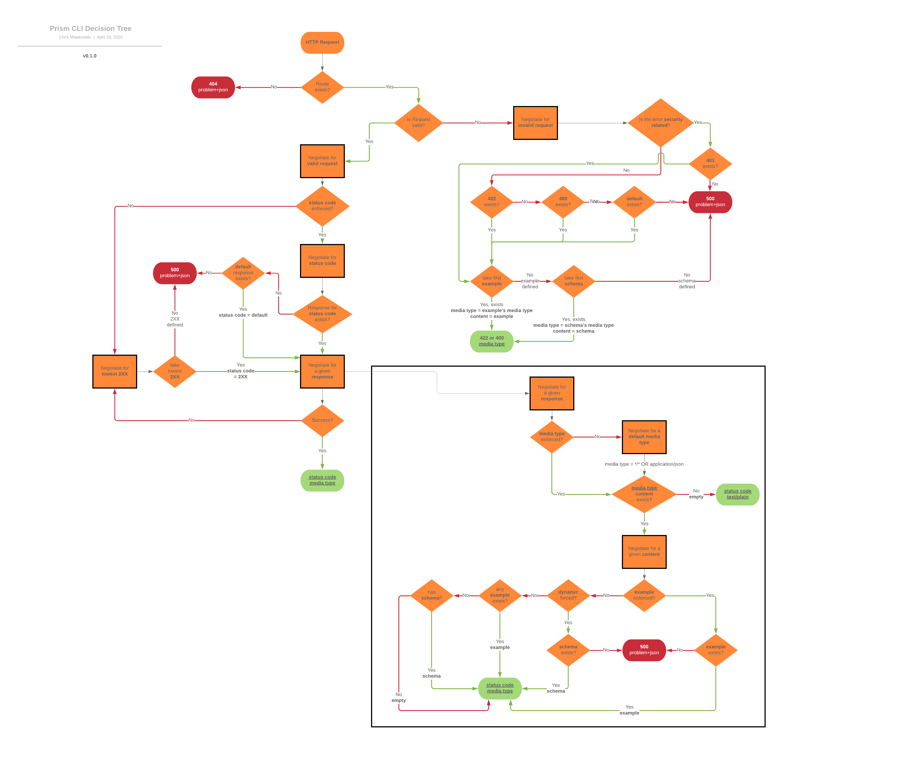

# HTTP Client

This package provides a HTTP client featuring the ability to:

- mock responses based of OpenAPI spec
- make requests to a HTTP server
- validate the request and/or the response according to the provided OpenAPI Specification file

In essence it's an HTTP client (similar to axios - in fact, we use axios to make requests) with the ability to mock responses and validate requests.

The goal of this document is to provide you with some basic code examples to get you started and to cover some of the advanced scenarios.

# Table of Contents

- [Installation](#installation)
- [Basic Usages](#basic-usages)
- [Advanced Topics](#advanced-topics)
  - [Creating Prism Instance](#creating-prism-instance)
    - [Config Property](#config-property)
      - [Config Examples](#config-examples)
  - [Loading specs](#loading-specs)
  - [Making requests](#making-requests)
    - [Server Validation](#server-validation)
  - [Understanding response](#understanding-response)
  - [Gotchas](#gotchas)

# Installation

```bash
yarn add @stoplight/prism-http
```

# Basic Usages

> Note: the examples in this document use the following spec

```yaml
openapi: 3.0.2
paths:
  /todos:
    get:
      parameters:
        - name: title
          in: query
          style: form
          schema:
            enum:
              - eat
              - drink
      responses:
        200:
          description: Get Todo Items
          content:
            'text/plain':
              example: Write great OpenAPI specs!
```

## Mock All Responses

[Try it out!](https://repl.it/@ChrisMiaskowski/prism-http-client-basic-mocking)

```javascript
const Prism = require('@stoplight/prism-http');
const path = require('path');

// Create Prism instance and configure it as a mocker generating static examples
const prism = Prism.createInstance({
  mock: { dynamic: false },
  validate: { request: { query: true } },
});

// Load openapi spec file
const specPath = path.resolve(process.cwd(), 'basic.oas3.yaml');
prism
  .load({ path: specPath })
  .then(() => {
    // Make a "GET /todos" request
    return prism.process({
      method: 'get',
      url: {
        path: '/todos',
      },
      headers: {
        Accept: 'text/plain',
      },
    });
  })
  .catch(e => console.error(e))
  .then(prismResponse => {
    console.log(prismResponse.output);
  });
```

Output

```bash
{
  statusCode: 200,
  headers: { 'Content-type': 'text/plain' },
  body: 'Write great OpenAPI specs!'
}
```

## Mock Single Response

In the following example we will first instantiate Prism to make requests to an actual server.

Later we alter than behaviour by passing a config object to the `process` function.

```javascript
const Prism = require('@stoplight/prism-http');
const path = require('path');

// Note that by default we don't want to mock responses
const prism = Prism.createInstance({ mock: false });
const specPath = path.resolve(process.cwd(), 'basic.oas3.yaml');

prism
  .load({ path: specPath })
  .then(() => {
    // Make a "GET /todos" request
    return prism.process(
      {
        method: 'get',
        url: {
          path: '/facts',
          baseUrl: 'https://cat-fact.herokuapp.com',
        },
      },
      {
        // We can override the default behaviour per request.
        mock: {
          dynamic: true,
        },
      }
    );
  })
  .then(prismResponse => {
    console.log(prismResponse.output);
  });
```

## Make Request To An Upstream Server

We don't want to mock a reqeust, we simply want to make the request, hit the actual server and get the response back.

```javascript
const Prism = require('@stoplight/prism-http');

// Create Prism instance and configure it to make HTTP requests (mock: false)
const config = { mock: false };
const prism = Prism.createInstance(config);
prism
  .process({
    method: 'get',
    url: {
      path: '/facts',
      baseUrl: 'https://cat-fact.herokuapp.com',
    },
  })
  .then(prismResponse => {
    console.log(prismResponse.output);
  });
```

In response you'll get some... facts about cats. For example:

> Cats aren’t the only animals that purr — squirrels, lemurs, elephants, and even gorillas purr too.

:)

# Advanced Topics

## Creating Prism Instance

In order to create and instance of HTTP Client (later referred to as `prism` for simplicity) use the `createInstance` function, like so:

```javascript
const Prism = require('@stoplight/prism-http');
const config = { mock: false };
const prism = Prism.createInstance(config /*, components */);
```

There are two (both optional) arguments you can supply `createInstance` with:

- config (of `IHttpConfig` type)
- components (of `TPrismHttpComponents` type)

We will cover the `config` argument in next section and we'll leave `components` for some other time (overriding default `components` is the _ultimate advanced stuff_).

### Config Object

Prism's config object (`IHttpConfig`) allows you to manipulate Prism's behaviour in many ways. For instance:

- turn validation on and off
- turn mocking on and off
- influence Prism's mocked response generation strategy

The actual interface looks like this (but rather than explain each property we're going to look at some examples)

```ts
export interface IHttpConfig extends IPrismConfig {
  mock: false | IHttpOperationConfig;

  validate?: {
    request?:
      | boolean
      | {
          hijack?: boolean;
          headers?: boolean;
          query?: boolean;
          body?: boolean;
        };

    response?:
      | boolean
      | {
          headers?: boolean;
          body?: boolean;
        };
  };
}
```

#### Config Examples

**Do not mock and do not validate requests**

```javascript
const config = {
  mock: false,
  validate: {
    request: false,
    // response is set to true by default
  },
};
```

With the above configuration the http client will proxy your requests to a server and will validate the response with the OpenAPI you loaded. However, it will not validate the input (e.g. will not check whether the provided query param is valid).

**Validate only request's body and response's headers**

```javascript
const config = {
  validate: {
    request: {
      body: true,
    },
    response: {
      headers: true,
    },
  },
};
```

**When mocking a response generate static response**

```javascript
const config = {
  mock: {
    dynamic: false,
  },
};
```

Generating static responses means that if an OpenAPI operation's response has any examples defined the payload we construct will use those examples.

This contrasts "dynamic responses" which means generating responses from a json schema.

**Return named example of a specified key**

```javascript
const config = {
  mock: {
    example: 'key',
  },
};
```

In OpenAPI Specification 3 one can construct such response that will have multiple examples mapped by keys.
This configuration allows you to be very specific which example you want to choose.

**Return 403 response of specified mime type**

```javascript
const config = {
  mock: {
    code: 403,
    mimeType: 'application/xml',
  },
};
```

This will enforce a 403 response (given that such response is defined in your OpenAPI file).

## Loading specs

When you load a spec you "teach" prism how your API looks like.
You can run prism without loading a spec, but features such as validation will be disabled.

```javascript
const loaderConfig = { path: '/absolute/file/path.oas3.yaml' };
const promise = prism.load(loaderConfig);
```

## Making requests

To make a basic request you need to do the following

```javascript
const request = {
  method: 'get',
  url: {
    path: '/path', // must be prefixed with slash
  },
};
const promise = prism.process(request);
```

The request object has the following interface

```ts
export interface IHttpRequest {
  method: IHttpMethod;
  url: IHttpUrl;
  headers?: IHttpNameValue;
  body?: any;
}
```

All of this is pretty standard except the `url.baseUrl` which we will describe in more details.

### Server Validation

Consider a request

```javascript
prism.process({
  method: 'get',
  url: {
    path: '/facts', // must be prefixed with slash
    baseUrl: 'https://cat-fact.herokuapp.com',
  },
});
```

Notice that `baseUrl` is defined.

This will instruct Prism to do one of the two:

- if mocking is **disabled** (`{ mock: false }`)
  - it will use that `baseUrl` to make a request to the server (`GET https://cat-fact.herokuapp.com/facts`)
  - it will **verify** whether the provided `baseUrl` matches any of the servers defined in your OpenAPI and **add an input warning to the .process return value if it is not valid**
- if mocking is **enabled**
  - it will **verify** whether the provided `baseUrl` matches any of the servers defined in your OpenAPI and **return an error if it is not valid**

## Understanding response

The `prism.process` resolved (it's a Promise!) value consists of:

- input - copy of the request object you provided
- output - the HTTP response
- validations
  - input - list of warnings/errors related to you http request object
  - output - list of warnings/errors related to you http response object

Validations are still subject of tests and experimentation therefore we will not cover them fully for the time being.

One example however is that for a given example

```javascript
const Prism = require('@stoplight/prism-http');

// Create Prism instance and configure it to make http requests
const config = { mock: false };
const prism = Prism.createInstance(config);
prism
  .process({
    method: 'get',
    url: {
      path: '/facts',
      baseUrl: 'https://cat-fact.herokuapp.com',
    },
  })
  .then(prismResponse => {
    console.log(prismResponse.validations.input);
  });
```

You would get this in response

```bash
[
  {
    message: 'Route not resolved, no resource provided.',
    source: 'https://stoplight.io/prism/errors#NO_RESOURCE_PROVIDED_ERROR',
    code: 404,
    severity: 1
  }
]
```

## Prism Decision Flow Diagram

The below diagram represents all logical decision we make to figure out the best HTTP response to the specific request.



## Gotchas

If provided request object contains `Host` header it will be replaced with `baseUrl` host. The original value will be set to `Forwarded` header with `host=` prefix.
